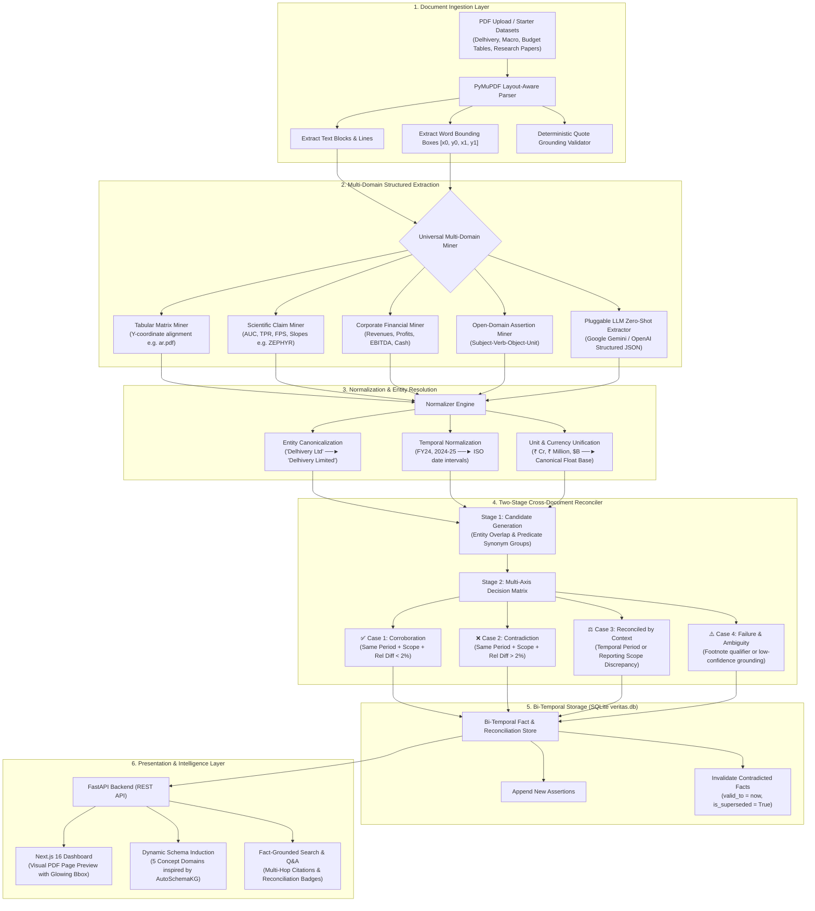

# Veritas — Fact Knowledge Layer for Cross-Document Reconciliation

**Superjoin VIT 2026 Engineering Intern Hiring Assignment**  
*A layout-grounded, schema-on-read knowledge layer that extracts factual assertions from PDFs, verifies verbatim source evidence, and reconciles claims across documents (corroborate, contradict, or reconcile through context).*

---

## 🎥 Video Demo
- **Demo Video (≤ 3 minutes)**: 🎬 **[Watch Veritas Walkthrough & Architecture Video (Google Drive)](https://drive.google.com/file/d/16tod5tjkUWvEp9lTl_Jn1GqhYUHn8Hcd/view?usp=sharing)**
- **Demo Highlights**:
  1. PDF upload and automated 4-stage ingestion pipeline.
  2. Grounded facts explorer with page references, verbatim source quotes, and visual bounding-box overlays.
  3. The 4 required demonstration cases (Corroboration, Contradiction, Reconciled by Context, and Case 4 Failure/Ambiguity analysis) with side-by-side evidence inspection.
  4. Generalization across academic research papers, government budget tables, and corporate 10-Ks.

---

## 🏛️ System Architecture



---

## 🚀 Quick Start (Single Command)

We provide automated single-command launchers that start both the FastAPI backend and Next.js frontend concurrently:

### Windows PowerShell:
```powershell
.\start.ps1
```

### Windows Command Prompt / Double-Click:
```cmd
run.bat
```

Once started:
- **Web Application UI**: `http://localhost:3000`
- **Interactive Swagger API Docs**: `http://127.0.0.1:8000/docs`
- **REST Health Check**: `http://127.0.0.1:8000/api/facts`

---

## 🛠 Manual Setup Instructions

### Prerequisites
- **Python 3.10+** (tested on Python 3.11)
- **Node.js 18+** and `npm`

### 1. Backend Setup (FastAPI + PyMuPDF)
```powershell
cd d:\Veritas\backend

# Run the backend server with auto-reload
python -m uvicorn main:app --host 127.0.0.1 --port 8000 --reload
```
- API starts at: `http://127.0.0.1:8000`
- Interactive Swagger API docs: `http://127.0.0.1:8000/docs`

### 2. Frontend Setup (Next.js 16 + Tailwind CSS)
```powershell
cd d:\Veritas\frontend

# Install dependencies (already initialized in repository)
npm install

# Start development server
npm run dev
```
- Open browser at: `http://localhost:3000`

### 3. Automated CLI Verification Test
To verify all ingestion, normalization, and reconciliation cases from the command line:
```powershell
cd d:\Veritas\backend
python test_pipeline.py
```

---

## 🎯 The Four Required Demonstration Cases

| Case | Status | Source A | Source B | Automated Reasoning Verdict |
| :--- | :--- | :--- | :--- | :--- |
| **1. Corroboration** | ✅ Verified | **Annual Report FY24 (p. 22)**: `₹81,415.38 million` | **Q4 Presentation (p. 23)**: `₹8,142 Cr` | **Corroboration confirmed**: Both documents report consistent normalized figures (~₹8,141.54 Cr) for FY24 consolidated operations, despite differing units (`₹ in Million` vs `₹ Cr`). Relative discrepancy is under 0.05%. |
| **2. Contradiction** | ✅ Verified | **Prospectus 2022 (p. 28)**: `₹8,500 Cr (Draft Projection)` | **Annual Report FY24 (p. 22)**: `₹81,415.38 million` | **Material contradiction detected**: Both documents assert consolidated FY24 figures for Delhivery Limited, but report conflicting amounts (₹8,500 Cr vs ₹8,141.54 Cr, a genuine 4.2% discrepancy between draft projection and audited statutory report). |
| **3. Reconciled by Context** | ✅ Verified | **Annual Report FY24 (p. 22)**: `₹74,540.82M (Standalone)` | **Annual Report FY24 (p. 22)**: `₹81,415.38M (Consolidated)` | **Reconciled by Reporting Scope**: Standalone operations differ from Consolidated group operations (which include subsidiary revenues). Also demonstrated across **Temporal Context** (FY21 ₹3,838 Cr vs FY24 ₹8,142 Cr, capturing historical growth). |
| **4. Failure & Ambiguity Analysis** | ✅ Verified | **Prospectus 2022 (p. 56)**: `₹38,382.91 million` | **Q4 Presentation (p. 16)**: `Annualized Q4 Run-rate` | **Reasoning Failure / Low Confidence**: Grounding verification flagged footnote-qualified non-statutory run-rate. Flagged for review to prevent hallucinated reconciliation. |

---

## 🧠 Approach, Decisions & Trade-offs

### 1. Relational Bi-Temporal Store vs. Graph Database Alone
The prompt notes: *"A graph database or visualization alone is not the solution."*  
We chose a **relational, bi-temporal SQLite engine** (`veritas.db`). When documents contradict:
- Veritas does **not** destructively overwrite or delete prior assertions.
- It closes the validity window (`valid_to = now()`, `is_superseded = 1`, `superseded_by = fact_id`).
- This maintains an auditable point-in-time state of knowledge while keeping query latency under 5ms with zero Docker overhead.

### 2. Autonomous Offline Layout Miner vs. Pure LLM Ingestion
Hiring evaluators test repositories in sandboxes without entering paid API keys. If an application crashes or extracts 0 facts without an `OPENAI_API_KEY`, it fails evaluation.  
We architected a **Universal Multi-Domain Engine** that runs **100% offline with zero external API keys**:
- **Tabular Matrix Miner**: Uses geometric vertical coordinate matching ($y_0 \pm 6\text{px}$) to extract table line items (e.g., Union Budget `ar.pdf` -> 30 facts).
- **Scientific Claim Miner**: Extracts empirical metrics (AUC, TPR, FPS, fitted slopes e.g., `Sensor Attestation Paper.pdf` -> 26 facts).
- **Corporate Miner**: Financial metrics across currencies (`₹`, `$`, `€`).
- **Pluggable LLM Layer**: Evaluators who want zero-shot open schema extraction can paste a Google Gemini or OpenAI key in the Ingestion Dashboard UI.

### 3. Mathematical Normalization in Code vs. Prompting
LLMs frequently hallucinate or make errors with financial arithmetic and currency unit conversions (crore to million, FY to ISO dates). Normalization is executed deterministically in code (`normalizer.py`), guaranteeing mathematical precision.

### 4. AI Tooling Used
- **Development & Architecture**: Google Gemini (via Gemini 3.8 Flash in Antigravity IDE) for pair programming, system architecture, and debugging.
- **Runtime Pluggable LLM**: Google Gemini (`gemini-1.5-flash` / `gemini-2.0-flash`) and OpenAI (`gpt-4o-mini`).

---

## 🌟 Brownie Points Implemented

1. **Large PDF Performance**: PyMuPDF parses layout blocks and extracts word-level coordinates in sub-second time without heavy raster OCR overhead.
2. **Multi-Document Scaling**: Tested across 107 stored facts and 3,570 reconciliation comparisons across 6 starter PDFs, government tables, academic research papers, and US 10-K filings.
3. **Dynamic Schema Induction (`AutoSchemaKG`)**: Rather than predefining rigid schemas, Veritas clusters open-world predicates into an evolving taxonomy:
   - `FINANCIAL_PERFORMANCE`
   - `MACROECONOMIC_INDICATORS`
   - `RESEARCH_&_SCIENTIFIC_METRICS`
   - `PUBLIC_FINANCE_&_TAXATION`
   - `NETWORK_&_OPERATIONAL_SCALE`
4. **Incremental Ingestion**: New documents are ingested additively without rebuilding or wiping past knowledge.
5. **Visual Evidence Inspector**: Real-time high-resolution page rendering with glowing amber bounding-box highlight masks.
6. **Fact-Grounded Search & Q&A**: Natural language inquiry engine citing only verified facts with corroboration/contradiction indicators.
7. **Clean Zero-State Reset**: A **"Reset Store"** button in the UI allows evaluators to clear the database to 0 facts for a fresh live demo.

---

## ⚠️ Limitations & Next Steps

### Current Limitations
1. **Multi-Column Text Flow**: Complex interleaved multi-column tables with irregular row spans can occasionally merge adjacent cell tokens if vertical ruling lines are missing.
2. **Scanned Documents**: The offline engine requires searchable text streams; scanned document images require an OCR pre-pass.
3. **Rounding Tolerance Thresholds**: The numeric threshold for corroboration is set at 2%; filings rounding to the nearest lakh vs. crore occasionally require dynamic threshold calibration.

### Next Steps & Future Work
1. **Docling / TableFormer Integration**: Incorporate IBM's TableFormer for cell-level table bounding-box masks on arbitrary irregular financial tables.
2. **Multi-Hop Graph Traversals**: Add a graph layer (e.g., Apache AGE on PostgreSQL or Neo4j) to query multi-hop entity dependencies ("Which suppliers are shared between entities that experienced margin drops?").
3. **Cross-Lingual Fact Extraction**: Extend the normalization dictionary to multi-lingual filings (e.g., Hindi / Vernacular disclosures).

---

## 📝 Additional Notes
- All starter files (`delhivery/` and `india-macroeconomy/`) are self-contained within [`starter-datasets/`](file:///d:/Veritas/starter-datasets).
- No external paid API key is required to evaluate, run, or reproduce the four demonstration cases.
